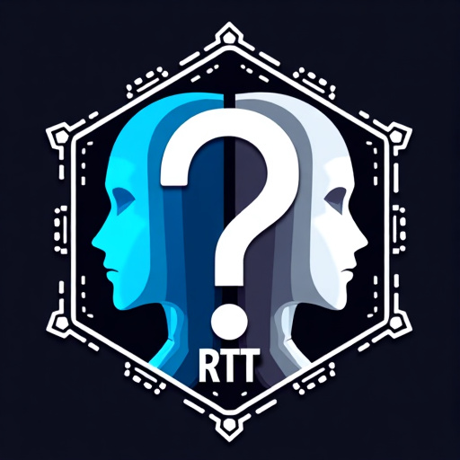

# 🤖 Reverse Turing Test Game 🧠

<p align="center">
  
</p>

[](https://opensource.org/licenses/MIT)
[](https://www.python.org/downloads/)
[](http://makeapullrequest.com)

Can you outsmart AI in a battle of wits? Welcome to the Reverse Turing Test Game! 🎭

## 🌟 Overview

In this thrilling game, you'll join a group of AI players, each with a unique role. Your mission? Blend in and convince the AIs that you're one of them while trying to unmask the other players. It's a high-stakes game of deception and detection!

### 🎯 Objectives

- **For the Human**: Survive rounds of questioning and voting without being discovered
- **For the AI**: Identify and eliminate the human player while mimicking human-like behavior

## 🚀 Features

- 🤖 Dynamic AI player interactions using cutting-edge language models
- 🎭 Role-based gameplay encouraging creative improvisation
- 🔍 Multiple rounds of cunning questions and deduction
- 🗣️ AI players strive to mimic human-like communication
- 🤝 Players can support or challenge others during cross-questioning
- 🗳️ Strategic voting with explanations for eliminations
- 🌈 Color-coded terminal output for an immersive experience
- 🔌 Compatible with Groq, OpenAI, Mistral, and Anthropic APIs

## 🎮 Gameplay

### Setup
Choose your role and select AI models for other players:

<p align="center">
  
</p>

<p align="center">
  
</p>

### Round 1: Opening Statements
Each player makes a statement about their role:

<p align="center">
  
</p>

### Cross-Questioning
Players select and interrogate each other:

<p align="center">
  
</p>

AI players ask questions to the human player:

<p align="center">
  
</p>

The human player can also ask questions to AI players:

<p align="center">
  
</p>

During cross-questioning, other players can choose to support or challenge either the questioner or the responder, adding depth to the interaction.

### Voting
All players vote on who they think is the human and provide reasoning for their choice:

<p align="center">
  
</p>

### Elimination
The player with the most votes is eliminated:

<p align="center">
  
</p>

### Next Round
The game continues with the next round of statements:

<p align="center">
  
</p>

## 🛠 Installation

1. Clone this repository:
   ```bash
   git clone https://github.com/rd-serendipity/reverse-turing-test-game.git
   ```
2. Navigate to the project directory:
   ```bash
   cd reverse-turing-test-game
   ```
3. Install the required dependencies:
   ```bash
   pip install -r requirements.txt
   ```
4. Set up your environment variables:
   ```bash
   cp .env.example .env
   # Edit .env with your API keys for Groq, OpenAI, Mistral, and Anthropic
   ```

## 🎮 How to Play

1. Start the game:
   ```bash
   python src/main.py
   ```
2. Follow the on-screen prompts to:
   - Choose AI models for other players
   - Select roles for all players
   - Make statements about your role
   - Select players to cross-question and explain your choice
   - Support or challenge other players during questioning
   - Vote on who you think is the human and explain your reasoning

### Game Flow


1. **Setup**: Choose AI models and assign roles
2. **Rounds**:
   - All players make statements
   - Players select and cross-question each other, explaining their choices
   - Other players can support or challenge during questioning
   - Everyone votes on the most suspicious player and explains their vote
3. **Elimination**: Player with most votes is out
4. **Winning Conditions**:
   - Human wins if they are the last player remaining with one AI
   - AIs win if they successfully eliminate the human

Remember, as the human player, your goal is to vote strategically to ensure your survival while convincing the AI players that you're one of them!


## 🔌 API Compatibility

This game is compatible with multiple AI APIs, including:
- Groq
- OpenAI
- Mistral
- Anthropic

Make sure to set up your API keys in the `.env` file for the services you plan to use.

## 🤝 Contributing

We love contributions! Check out our [CONTRIBUTING.md](CONTRIBUTING.md) for guidelines on how to:

- 🐛 Report bugs
- 💡 Suggest enhancements
- 📝 Improve documentation
- 🖥 Create a user interface

## 📜 License

This project is licensed under the MIT License - see the [LICENSE](LICENSE) file for details.

## 🙏 Acknowledgments

- Thanks to all the AI models and APIs that make this game possible
- Inspired by the classic Turing test and the fascinating world of AI

---

<p align="center">
  <strong>Outsmart AI, or Become One! 🏆</strong>
</p>

<p align="center">
  <a href="https://github.com/rd-serendipity/reverse-turing-test-game/issues">Report Bug</a> ·
  <a href="https://github.com/rd-serendipity/reverse-turing-test-game/issues">Request Feature</a>
</p>
